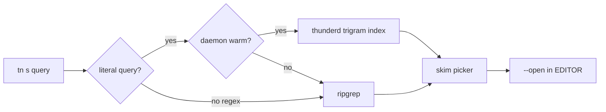

<p align="center">
  
  
  
  
</p>

<h1 align="center">Thunder</h1>

<p align="center">
  <strong>Search. Pick. Fix. Fly.</strong><br/>
  A unified terminal workflow — ripgrep speed, fzf UX, thefuck smarts — in two keystrokes.
</p>

<p align="center">
  <code>tn s auth</code> &nbsp;·&nbsp; <code>tn fl</code> &nbsp;·&nbsp; <code>tn f</code> &nbsp;·&nbsp; <code>tn</code>
</p>

---

## What is Thunder?

Thunder replaces the trio of tools you reach for dozens of times a day:

| You used to run | Now run |
|-----------------|---------|
| `rg foo \| fzf` | `tn s foo` |
| `fd \| fzf` | `tn fl` |
| `thefuck` | `tn f` |
| `fzf` on history | `tn h` |
| Everything at once | `tn` |

**One binary. Two letters. Zero friction.**

## Features

- **Warm index daemon** — sub-millisecond literal search on repeated queries via `thunderd`
- **Ripgrep fallback** — full regex power when the index isn't enough
- **Embedded skim picker** — fzf-quality TUI, no extra install required
- **11 native fix rules** — git, sudo, cd, npm, docker, python, cargo, pip, kubectl, brew, man
- **Omni palette** — files + command history in one searchable view
- **Per-project daemon** — each repo gets its own socket and index
- **Trigram-accelerated index** — fast candidate filtering on large codebases
- **Shell integration** — zsh, bash, fish with stderr capture for smart fixes
- **Security hardened** — preview validation, path sandboxing, dangerous command blocking

## Install

```bash
git clone https://github.com/desenyon/thunder.git
cd thunder
cargo build --release

export PATH="$PWD/target/release:$PATH"
tn c --init
eval "$(tn i zsh)"    # add to ~/.zshrc
```

### Dependencies

| Tool | Required | Purpose |
|------|----------|---------|
| `rg` (ripgrep) | Yes | Regex search fallback |
| `bat` | No | Nicer previews (auto-detected) |
| `thefuck` | No | Extended fix fallback |
| `fzf` | No | Alternative picker backend |

## Command reference

### Essentials

| Command | What it does |
|---------|--------------|
| `tn` | Omni palette (files + history) |
| `tn QUERY` | Search + pick results |
| `tn s QUERY` | Search codebase |
| `tn fl [QUERY]` | Fuzzy-find files |
| `tn h [QUERY]` | Search command history |
| `tn f` | Suggest fix for last command |
| `tn f -y` | Apply fix immediately |

### Power user

| Command | What it does |
|---------|--------------|
| `tn s QUERY --open` | Search and open in `$EDITOR` |
| `tn s QUERY --json` | JSON output for scripting |
| `tn pal --execute` | Palette with immediate actions |
| `tn d st` | Start index daemon |
| `tn d ss` | Daemon status |
| `tn d sp` | Stop daemon |
| `tn d rs` | Restart daemon |
| `tn d ri` | Force reindex |
| `tn doc` | Health check / diagnostics |
| `tn cmp zsh` | Shell completions |

### Shell aliases

After `eval "$(tn i zsh)"`:

```
ts QUERY   →  tn s QUERY      search
tp         →  tn p            pick
tf         →  tn f            fix
tfl        →  tn fl           files
th         →  tn h            history
td         →  tn d            daemon
tpal       →  tn pal          palette
tdoc       →  tn doc          doctor
fix        →  tn f            (supports -y)
```

## How search routing works



Literal queries hit the warm per-project index first. Regex or cold starts fall back to ripgrep. Results flow into skim for interactive picking.

## Configuration

Config path: `~/.config/thunder/config.toml`

```toml
[general]
editor = "nvim"          # override $EDITOR
open_on_select = false   # open files after search pick

[search]
use_daemon = true
fallback = "rg"
max_file_size_bytes = 2097152
max_results = 500

[pick]
height = "60%"
preview = "bat -n --color=always {1}"   # auto-detected if omitted
use_fzf = false
reverse = true
prompt = "> "

[fix]
use_thefuck_fallback = true
enabled_rules = ["git", "sudo", "cd", "npm", "docker", "man", "python", "cargo", "pip", "kubectl", "brew"]

[daemon]
auto_start = true
max_results = 500

[history]
max_entries = 2000
palette_limit = 200
```

## Security

- Preview commands validated against shell injection
- Index paths cannot escape project root (`..` blocked)
- Fix corrections blocked for dangerous patterns (`rm -rf /`, etc.)
- Multiline commands rejected on apply
- Daemon sockets created with `0600` permissions
- Explicit `-y` / `--apply` required to run corrections

## Development

```bash
cargo build              # debug build
cargo test               # unit + integration tests
./scripts/qa.sh          # full end-to-end QA
tn doc                   # local health check
```

## Architecture

```
thunder/
├── thunder-cli/     tn + thunder binaries
├── thunder-core/    config, history, security, editor
├── thunder-search/  ripgrep + daemon routing, file search
├── thunder-index/   thunderd daemon, trigram index
├── thunder-pick/    skim / fzf wrapper
└── thunder-fix/     native rules + thefuck fallback
```

## Credits

Built on excellent open source:

- [ripgrep](https://github.com/BurntSushi/ripgrep) — search
- [skim](https://github.com/skim-rs/skim) — fuzzy picker
- [thefuck](https://github.com/nvbn/thefuck) — correction fallback

See [NOTICE](NOTICE) for licenses.

## License

MIT — see [LICENSE](LICENSE).
