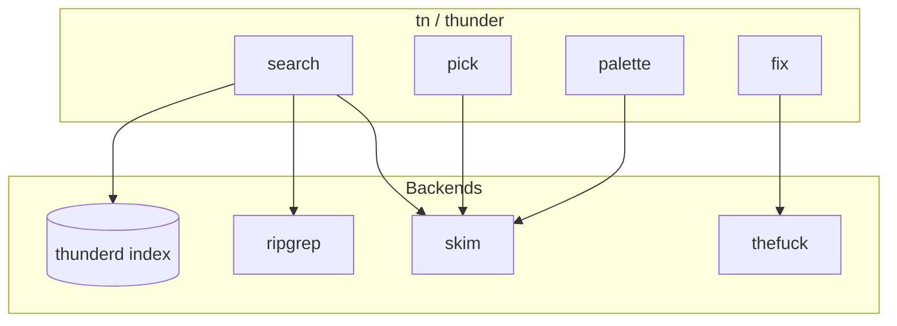

<p align="center">
  
  
  
</p>

<h1 align="center">Thunder</h1>

<p align="center">
  <strong>Search. Pick. Fix.</strong><br/>
  A blazing-fast terminal workflow built on ripgrep, skim, and smart corrections.
</p>

<p align="center">
  <code>tn s auth</code> · <code>tn p</code> · <code>tn f</code> · <code>tn</code>
</p>

---

## Why Thunder?

| Tool | What it does | Thunder |
|------|----------------|---------|
| ripgrep | Fast search | ✅ Built-in + warm index daemon |
| fzf / skim | Fuzzy picker | ✅ Embedded skim, optional fzf |
| thefuck | Fix typos | ✅ Native rules + thefuck fallback |

One binary. Two-letter commands. No typing `thunder` ever again.

## Quick start

```bash
# Clone & build
git clone https://github.com/desenyon/thunder.git
cd thunder
cargo build --release

# Add to PATH
export PATH="$PWD/target/release:$PATH"

# Shell hooks (zsh/bash)
eval "$(tn i zsh)"

# First-run config
tn c --init

# Start the index daemon (optional, for instant repeat searches)
tn d st
```

## Commands

### Short form (`tn`) — recommended

| Command | Action |
|---------|--------|
| `tn` | Omni palette (files + history) |
| `tn QUERY` | Search + interactive pick |
| `tn s QUERY` | Search |
| `tn p` | Fuzzy pick from stdin |
| `tn f` | Suggest fix for last command |
| `tn f -y` | Apply fix |
| `tn pal` | Open palette |
| `tn d st` | Start index daemon |
| `tn d ss` | Daemon status |
| `tn i zsh` | Print shell integration |
| `tn c --init` | Write default config |

### Shell aliases (after `eval "$(tn i zsh)"`)

```bash
ts QUERY    # tn s QUERY
tp          # tn p
tf          # tn f
td          # tn d
fix         # tn f (with -y support)
```

### Long form (`thunder`)

All `tn` commands work with `thunder` and full subcommand names:

```bash
thunder search --no-ui "fn main" crates/
thunder pick < files.txt
thunder fix --apply
```

## Architecture



**Search routing:** literal queries hit the warm `thunderd` index first (sub-ms on large repos), then fall back to ripgrep for regex or cold starts.

## Configuration

`~/.config/thunder/config.toml` (or `~/Library/Application Support/thunder/config.toml` on macOS):

```toml
[search]
use_daemon = true
max_file_size_bytes = 2097152

[pick]
height = "60%"
preview = "sed -n '{2}p' {1}"

[fix]
use_thefuck_fallback = true
enabled_rules = ["git", "sudo", "cd", "npm", "docker", "man"]

[daemon]
auto_start = true
max_results = 500
```

## Security

- Preview commands are validated — no shell injection (`;`, `|`, `$()`, etc.)
- Indexed paths cannot escape the project root
- Dangerous corrections (`rm -rf /`, etc.) are blocked before apply
- Daemon socket is created with `0600` permissions
- Fix apply requires explicit `-y` / `--apply`

## Development

```bash
cargo build
cargo test
./scripts/qa.sh          # full end-to-end QA
```

## Credits

Thunder stands on the shoulders of excellent open source projects:

- [ripgrep](https://github.com/BurntSushi/ripgrep) — search backend
- [skim](https://github.com/skim-rs/skim) — fuzzy picker
- [thefuck](https://github.com/nvbn/thefuck) — correction fallback

See [NOTICE](NOTICE) for license details.

## License

MIT — see [LICENSE](LICENSE).
